<html>
    <h1 style="font-size:90%; font-family:verdana; color:#28AFE0">INTRO</h1>
        <div align="justify">
            <p>
            MathAct is a math playing/visualization toolset for Scala.  You can use it as additional toolset in your small research/testing/playing projects.
            This project is spin-off from an biggest research project. Currently it contain low number of tool but I will be add new as they are will created.
            </p>
        </div>
        <h1 style="font-size:90%; font-family:verdana; color:#28AFE0">ARCHITECTURE</h1>
        <div align="justify">
            <p>
            The mathact.tools package contain set of tools, which can be divide on a calculation tools and a visualization tools. Most of tools generate "changed" events and handle "update" events. Tools interconnected by Clockwork instance, which responsible for spreading of events:
            </p>
        </div>
        <div align="center">
            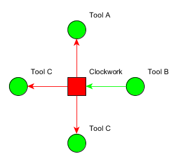
         </div>
        <div align="justify">
            <p>
            Changed events generate by tool when it change state, like example by user activity or time out.  By receiving changed events, clockwork generate new update events for each tool. The calculation tools receive update events first. The visualization tools receive update events last. I.e. updating of tools occurs in two-step: "calculation" and "visualization".
            </p>
        </div>
    <h1 style="font-size:90%; font-family:verdana; color:#28AFE0">USING EXAMPLE (Oja's rule playing)</h1>
    <h2 style="font-size:70%; font-family:verdana; color:#28AFE0"><a href="https://github.com/AlexCAB/MathAct/blob/master/src/main/scala/examples/general/OjaRuleExample.scala">Code:</a></h2>
</html>
```scala

  object OjaRuleExample extends Workbench{
  
    //Variables
    val potBoard = new PotBoard{
      val xs = array(.1, .2)   //Input
      val η = in(0,1)}         //Learning rate
    import potBoard._
    var ws = Array(.1, .1)     //Weights
    var y = .0                 //Output
    
    //Calculation
    def calcOutput() = {
      y = 1 / (1 + exp( - xs.zip(ws).map{case(x,w) ⇒ x * w}.sum))
    }
    def calcWeights() = {
      ws = xs.zip(ws).map{case(x,w) ⇒ {w + η * (x * y - y * y * w)}}
    }
    
    //Chart
    val chart = new YChartRecorder{
      trace("Input_0", green) of(xs(0))
      trace("Input_1", navy) of(xs(1))
      trace("Weights_0", maroon) of(ws(0))
      trace("Weights_1", red) of(ws(1))
      trace("Output", black) of(y)
    }
    
    //Doer
    new Doer{make{
      calcOutput()
      calcWeights()
      chart.update()
    }}
  }
          
```
<html>
 <h2 style="font-size:70%; font-family:verdana; color:#28AFE0">Working:</h2>
        <div align="center">
            <div align="center">
                <a href="https://www.youtube.com/watch?v=X5OJM1dUNJ8">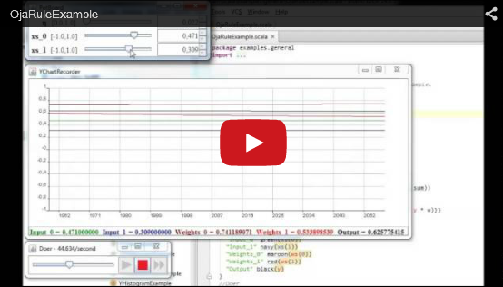</a>
            </div>
        </div>
    <h2 style="font-size:70%; font-family:verdana; color:#28AFE0">Line by line description:</h2>
        <div align="left" style="font-family:Consolas;"><pre>
          object OjaRuleExample extends Workbench{
        </pre></div>
        <div align="justify">
            <a href="https://github.com/AlexCAB/MathAct/blob/master/src/main/scala/mathact/tools/Workbench.scala">Workbench</a> is container object where all tools place.
        </div>
        <div align="left" style="font-family:Consolas;"><pre>
          val potBoard = new PotBoard{
          val xs = array(.1, .2)   //Input
          val η = in(0,1)}         //Learning rate
        </pre></div>
        <div align="justify">
            Creating of <a href="https://github.com/AlexCAB/MathAct/blob/master/src/main/scala/mathact/tools/pots/PotBoard.scala">PotBoard tool</a>, which contains array xs of the Impute values in default range [-1,+1]
            and the learning rate coefficient, η in range [0,+1].
        </div>
        <div align="left" style="font-family:Consolas;"><pre>
          import potBoard._
        </pre></div>
        <div align="justify">
            Import of variables for more comfortable use.
        </div>
        <div align="left" style="font-family:Consolas;"><pre>
          var ws = Array(.1, .1)     //Weights
          var y = .0                 //Output
        </pre></div>
        <div align="justify">
            Weights and Output variables.
        </div>
        <div align="left" style="font-family:Consolas;"><pre>
          def calcOutput() = {
            y = 1 / (1 + exp( - xs.zip(ws).map{case(x,w) ⇒ x * w}.sum))
          }
        </pre></div>
        <div align="justify">
            Simple neuron calculation.
        </div>
        <div align="left" style="font-family:Consolas;"><pre>
          def calcWeights() = {
            ws = xs.zip(ws).map{case(x,w) ⇒ {w + η * (x * y - y * y * w)}}
          }
        </pre></div>
        <div align="justify">
            Oja's rule calculation.
        </div>
        <div align="left" style="font-family:Consolas;"><pre>
          val chart = new YChartRecorder{
            trace("Input_0", green) of(xs(0))
            trace("Input_1", navy) of(xs(1))
            trace("Weights_0", maroon) of(ws(0))
            trace("Weights_1", red) of(ws(1))
            trace("Output", black) of(y)
          }
        </pre></div>
        <div align="justify">
            Creating of <a href="https://github.com/AlexCAB/MathAct/blob/master/src/main/scala/mathact/tools/plots/YChartRecorder.scala">YChartRecorder</a> tool, with five trace with different color.
        </div>
        <div align="left" style="font-family:Consolas;"><pre>
          new Doer{make{
           calcOutput()
           calcWeights()
           chart.update()
          }}
        </pre></div>
        <div align="justify">
            Creating of <a href="https://github.com/AlexCAB/MathAct/blob/master/src/main/scala/mathact/tools/doers/Doer.scala">Doer</a> tool, which execute the make bloc N times per second. In wherein: 1) call calcOutput(),
            2) call calcWeights(), 3) Update chart (make variables snapshot).
        </div>
    <h1 style="font-size:90%; font-family:verdana; color:#28AFE0">HOW TO GET</h1>
        <div align="justify">
            Currently you can fork this repo or down load sources as a zip file.
        </div>
    <h1 style="font-size:90%; font-family:verdana; color:#28AFE0">TOOLS</h1>
      <a href="#Doer">Doer</a><br>
      <a href="#Stepper">Stepper</a><br>
      <a href="#Calc">Calc</a><br>
      <a href="#CalcWithManual">CalcWithManual</a><br>
      <a href="#Logger">Logger</a><br>
      <a href="#XTracer">XTracer</a><br>
      <a href="#YHistogram">YHistogram</a><br>
      <a href="#XYHistogram">XYHistogram</a><br>
      <a href="#XYPlot">XYPlot</a><br>
      <a href="#YChartRecorder">YChartRecorder</a><br>
      <a href="#PotBoard">PotBoard</a><br>
      <a href="#ValuesBoard">ValuesBoard</a><br>
      <a href="#SimpleStaticGraph">SimpleStaticGraph</a><br>
    <h2 style="font-size:70%; font-family:verdana; color:#28AFE0">Tools parameters</h2>
        <div align="justify">
            <p>All tools take parameters by the class constructor arguments.</p>
            <p>Most tool have next general parameters: </p>
        </div>
        <div align="left" style="font-family:Consolas;"><pre>
            name -- specify displayed tool name, by default it is a class or singleton
              object name.
            screenX, screenY -- specify position of tool window in screen coordinates,
              by default windows place in up to down and left to right order, starting
              from coordinates specified in  Workbench (10,10 by default).
            screenW, screenH -- specify tool width and height.
        </pre></div>
    <h2 style="font-size:70%; font-family:verdana; color:#28AFE0">Workbench</h2>
        <a href="https://github.com/AlexCAB/MathAct/blob/master/src/main/scala/mathact/tools/Workbench.scala">Source code</a>
        <div align="justify">
            Used as a container for placing of tools.
        </div>
        <h3 style="font-size:50%; font-family:verdana; color:#28AFE0">Parameters:</h3>
        <div align="left" style="font-family:Consolas;"><pre>
            x:Int, y:Int -- work area position in screen coordinates (default: 10, 10),
            width:Int, height:Int -- work area size (default: full screen),
            parameters:Parameters -- UI and working parameters
              (default: mathact.utils.Parameters).
        </pre></div>
    <h2 style="font-size:70%; font-family:verdana; color:#28AFE0"id="Doer">Doer calculation tool</h2>
        <div align="center">
            
        </div>
        <div align="justify">
            Execute one or several make{} blocs N time per second.
        </div>
        <a href="https://github.com/AlexCAB/MathAct/blob/master/src/main/scala/mathact/tools/doers/Doer.scala">Source code</a>,
        <a href="https://github.com/AlexCAB/MathAct/blob/master/src/main/scala/examples/mathact/tools/doers/DoerExample.scala">Example code</a>
        <h3 style="font-size:50%; font-family:verdana; color:#28AFE0">Parameters:</h3>
        <div align="left" style="font-family:Consolas;"><pre>
            name:String, screenX:Int, screenY:Int -- general parameters,
            speedMin:Double -- min times per second (default: .1),
            speedMax:Double --   mac times per second (default: 100),
            speedInit:Double  -- initial times per second (default: 1).
        </pre></div>
    <h2 style="font-size:70%; font-family:verdana; color:#28AFE0"id="Stepper">Stepper calculation tool</h2>
        <div align="center">
            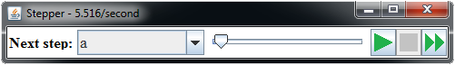
        </div>
        <div align="justify">
            Execute the step blocs one by one, N time per second.
        </div>
        <a href="https://github.com/AlexCAB/MathAct/blob/master/src/main/scala/mathact/tools/doers/Stepper.scala">Source code</a>,
        <a href="https://github.com/AlexCAB/MathAct/blob/master/src/main/scala/examples/mathact/tools/doers/StepperExample.scala">Example code</a>
        <h3 style="font-size:50%; font-family:verdana; color:#28AFE0">Syntax:</h3>
        <div align="left" style="font-family:Consolas;"><pre>
            step(&lt;step parameters&gt;) make{&lt;code bloc&gt;}
            <p>Where:</p>
             &lt;step params&gt; -- name = "...".
             &lt;code bloc&gt; -- Any Scala code.
        </pre></div>
        <h3 style="font-size:50%; font-family:verdana; color:#28AFE0">Parameters:</h3>
        <div align="left" style="font-family:Consolas;"><pre>
            name:String, screenX:Int, screenY:Int -- general parameters,
            speedMin:Double -- min times per second (default: .1),
            speedMax:Double --   mac times per second (default: 100),
            speedInit:Double  -- initial times per second (default: 1).
        </pre></div>
    <h2 style="font-size:70%; font-family:verdana; color:#28AFE0" id="Calc">Calc calculation  tool</h2>
        <div align="justify">
            Execute one or several <b>make{}</b> blocs by update event.
        </div>
        <a href="https://github.com/AlexCAB/MathAct/blob/master/src/main/scala/mathact/tools/doers/Calc.scala">Source code</a>,
        <a href="https://github.com/AlexCAB/MathAct/blob/master/src/main/scala/examples/mathact/tools/doers/CalcExample.scala">Example code</a>
        <h3 style="font-size:50%; font-family:verdana; color:#28AFE0">Parameters:</h3>
        <div align="left" style="font-family:Consolas;"><pre>
            Have no parameters.
        </pre></div>
    <h2 style="font-size:70%; font-family:verdana; color:#28AFE0" id="CalcWithManual">CalcWithManual calculation tool</h2>
        <div align="center">
            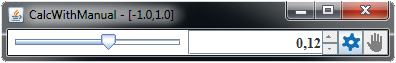
        </div>
        <div align="justify">
            Execute one/several <b>auto{x ⇒ }</b> blocs if auto mode on, or one/several <b>manual{x ⇒ }</b> blocks if manual mode on. The <b>x</b> is value specified by UI.
        </div>
        <a href="https://github.com/AlexCAB/MathAct/blob/master/src/main/scala/mathact/tools/doers/CalcWithManual.scala">Source code</a>,
        <a href="https://github.com/AlexCAB/MathAct/blob/master/src/main/scala/examples/mathact/tools/doers/CalcWithManualExample.scala">Example code</a>
        <h3 style="font-size:50%; font-family:verdana; color:#28AFE0">Parameters:</h3>
        <div align="left" style="font-family:Consolas;"><pre>
            name:String, screenX:Int, screenY:Int -- general parameters,
            min:Double -- x min (default: -1),
            max:Double -- x max (default: +1),
            value:Double -- x initial (default: 0),
            initIsAuto:Boolean -- if true start in auto mode (default: false).
        </pre></div>
    <h2 style="font-size:70%; font-family:verdana; color:#28AFE0" id="Logger">Logger visualization tool</h2>
        <div align="center">
            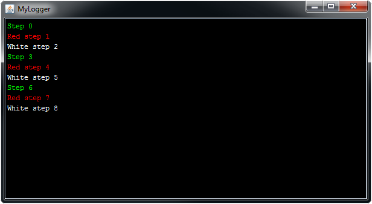
        </div>
        <div align="justify">
            Simple logger with color text. Have methods <b>log(msg:String)</b> which add text with default color (specified in mathact.utils.Parameters) and <b>randColor(msg:String)</b> which add text with random color. Also have <b>black, white, red, lime, blue, yellow, cyan, magenta, silver, gray, maroon, olive, green, purple, teal, navy</b> which add text with corresponding color.
        </div>
        <a href="https://github.com/AlexCAB/MathAct/blob/master/src/main/scala/mathact/tools/loggers/Logger.scala">Source code</a>,
        <a href="https://github.com/AlexCAB/MathAct/blob/master/src/main/scala/examples/mathact/tools/loggers/LoggerExample.scala">Example code</a>
        <h3 style="font-size:50%; font-family:verdana; color:#28AFE0">Parameters:</h3>
        <div align="left" style="font-family:Consolas;"><pre>
           name:String, screenX:Int, screenY:Int, screenW:Int, screenH:Int -- general
             parameters,
           maxSize:Int -- max number of lines (default: 1000).
        </pre></div>
    <h2 style="font-size:70%; font-family:verdana; color:#28AFE0" id="XTracer">XTracer visualization tool</h2>
        <div align="center">
            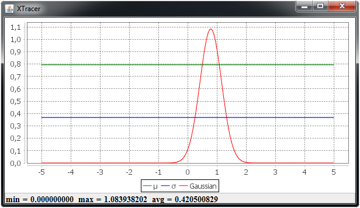
        </div>
        <div align="justify">
            Trace given <b>Double⇒Double</b> functions on [a,b] diapason by update event.
        </div>
        <a href="https://github.com/AlexCAB/MathAct/blob/master/src/main/scala/mathact/tools/plots/XTracer.scala">Source code</a>,
        <a href="https://github.com/AlexCAB/MathAct/blob/master/src/main/scala/examples/mathact/tools/plots/XTracerExample.scala">Example code</a>
        <h3 style="font-size:50%; font-family:verdana; color:#28AFE0">Syntax:</h3>
        <div align="left" style="font-family:Consolas;"><pre>
            trace(&lt;trace params&gt;) of{x ⇒ }
            <p>Where:</p>
            &lt;trace params&gt; -- name = "..."; color = black, white, red,...
            {x ⇒ } --  Double⇒Double function
        </pre></div>
        <h3 style="font-size:50%; font-family:verdana; color:#28AFE0">Parameters:</h3>
        <div align="left" style="font-family:Consolas;"><pre>
            name:String, screenX:Int, screenY:Int, screenW:Int, screenH:Int -- general
              parameters,
            a:Double -- begin of X diapason (default: -1),
            b:Double -- end of X diapason (default: +1),
            step:Double -- trace step by X (default: 0.05),
            minRange:Double -- min plot Y range (default: -1),
            maxRange:Double -- max plot  Y range (default: +1),
            autoRange:Boolean -- Y auto range (default: false),
            drawPoints:Boolean -- if true draw samples  point (default: false).
        </pre></div>
    <h2 style="font-size:70%; font-family:verdana; color:#28AFE0" id="YHistogram">YHistogram visualization tool</h2>
        <div align="center">
            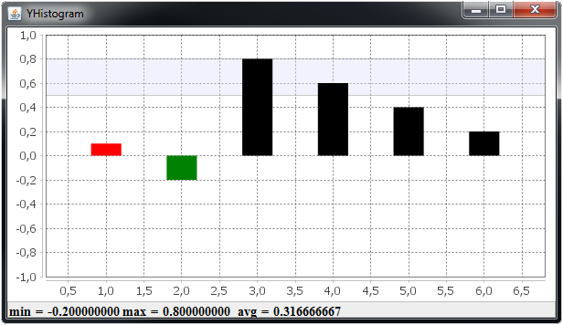
        </div>
        <div align="justify">
            Draw histogram with different bar colors by update event. Place bars in equal distance by X.
        </div>
        <a href="https://github.com/AlexCAB/MathAct/blob/master/src/main/scala/mathact/tools/plots/YHistogram.scala">Source code</a>,
        <a href="https://github.com/AlexCAB/MathAct/blob/master/src/main/scala/examples/mathact/tools/plots/YHistogramExample.scala">Example code</a>
        <h3 style="font-size:50%; font-family:verdana; color:#28AFE0">Syntax:</h3>
        <div align="left" style="font-family:Consolas;"><pre>
             data(&lt;bar params&gt;) of{&lt;Y variable name&gt;}
             data(&lt;bar params&gt;) ofArray{&lt;array of Y variable name&gt;}
            <p>Where:</p>
            &lt;bar params&gt; -- color = black, white, red,...
            &lt;Y variable name&gt; -- Double variable name.
            &lt;array of Y variable name&gt; -- Array[Doable] variable name.
        </pre></div>
        <h3 style="font-size:50%; font-family:verdana; color:#28AFE0">Parameters:</h3>
        <div align="left" style="font-family:Consolas;"><pre>
            name:String, screenX:Int, screenY:Int, screenW:Int, screenH:Int -- general
              parameters,
            minRange:Double -- min plot Y range (default: -1),
            maxRange:Double -- max plot  Y range (default: +1),
            autoRange:Boolean -- Y auto range (default: false),
            targetLower:Double -- min target  Y range (default: 0),
            targetUpper:Double -- max target  Y range (default: 0).
        </pre></div>
    <h2 style="font-size:70%; font-family:verdana; color:#28AFE0" id="XYHistogram">XYHistogram visualization tool</h2>
        <div align="center">
            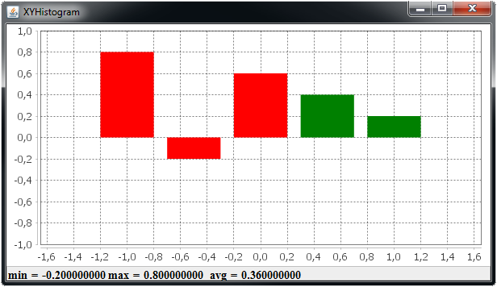
        </div>
        <div align="justify">
            Draw histogram with different bar colors by update event.
        </div>
        <a href="https://github.com/AlexCAB/MathAct/blob/master/src/main/scala/mathact/tools/plots/XYHistogram.scala">Source code</a>,
        <a href="https://github.com/AlexCAB/MathAct/blob/master/src/main/scala/examples/mathact/tools/plots/XYHistogramExample.scala">Example code</a>
        <h3 style="font-size:50%; font-family:verdana; color:#28AFE0">Syntax:</h3>
        <div align="left" style="font-family:Consolas;"><pre>
            data(&lt;bar params&gt;) of{(&lt;X&gt;,&lt;Y&gt;)}
            data(&lt;bar params&gt;) ofArray{(&lt;array of X&gt;,&lt;array of Y&gt;)}
            <p>Where:</p>
            &lt;bar params&gt; -- color = black, white, red,...
            (&lt;X&gt;,&lt;Y&gt;) -- Tuple2[Double] variable.
            (&lt;array of X&gt;,&lt;array of Y&gt;) -- Tuple2[Array[Doable], Array[Doable]] variable.
        </pre></div>
        <h3 style="font-size:50%; font-family:verdana; color:#28AFE0">Parameters:</h3>
        <div align="left" style="font-family:Consolas;"><pre>
            name:String, screenX:Int, screenY:Int, screenW:Int, screenH:Int -- general
            parameters,
            minRange:Double -- min plot Y range (default: -1),
            maxRange:Double -- max plot  Y range (default: +1),
            autoRange:Boolean -- Y auto range (default: false),
            targetLower:Double -- min target  Y range (default: 0),
            targetUpper:Double -- max target  Y range (default: 0).
        </pre></div>
    <h2 style="font-size:70%; font-family:verdana; color:#28AFE0" id="XYPlot">XYPlot visualization tool</h2>
        <div align="center">
            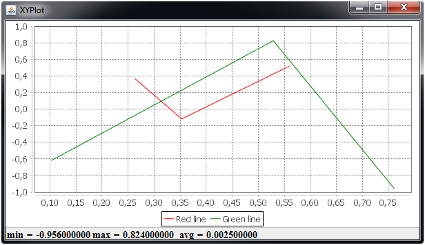
        </div>
        <div align="justify">
            Simple XY plot with different line colors.
        </div>
        <a href="https://github.com/AlexCAB/MathAct/blob/master/src/main/scala/mathact/tools/plots/XYPlot.scala">Source code</a>,
        <a href="https://github.com/AlexCAB/MathAct/blob/master/src/main/scala/examples/mathact/tools/plots/XYPlotExample.scala">Example code</a>
        <h3 style="font-size:50%; font-family:verdana; color:#28AFE0">Syntax:</h3>
        <div align="left" style="font-family:Consolas;"><pre>
            line(&lt;line params&gt;) of{(&lt;X&gt;,&lt;Y&gt;)}
            <p>Where:</p>
            &lt;line params&gt; -- name = "..."; color = black, white, red,...
            (&lt;array of X&gt;,&lt;array of Y&gt;) -- Tuple2[Array[Doable], Array[Doable]] variable.
        </pre></div>
        <h3 style="font-size:50%; font-family:verdana; color:#28AFE0">Parameters:</h3>
        <div align="left" style="font-family:Consolas;"><pre>
            name:String, screenX:Int, screenY:Int, screenW:Int, screenH:Int -- general
              parameters,
            minRange:Double -- min plot Y range (default: -1),
            maxRange:Double -- max plot  Y range (default: +1),
            autoRange:Boolean -- Y auto range (default: false),
            drawPoints:Boolean -- if true draw samples  point (default: false).
        </pre></div>
    <h2 style="font-size:70%; font-family:verdana; color:#28AFE0" id="YChartRecorder">YChartRecorder visualization tool</h2>
        <div align="center">
            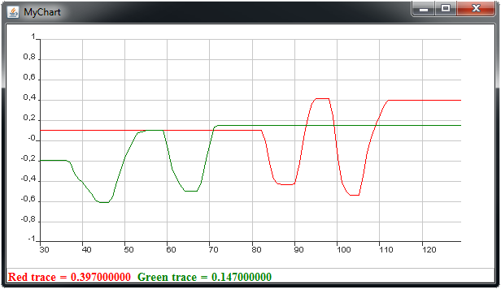
        </div>
        <div align="justify">
            Chart recorder. Add new variables snapshot by update event or by calling update() method.
        </div>
        <a href="https://github.com/AlexCAB/MathAct/blob/master/src/main/scala/mathact/tools/plots/YChartRecorder.scala">Source code</a>,
        <a href="https://github.com/AlexCAB/MathAct/blob/master/src/main/scala/examples/mathact/tools/plots/YChartRecorderExample.scala">Example code</a>
        <h3 style="font-size:50%; font-family:verdana; color:#28AFE0">Syntax:</h3>
        <div align="left" style="font-family:Consolas;"><pre>
            trace(&lt;trace params&gt;) of{&lt;Y variable name&gt;}
            <p>Where:</p>
            &lt;trace params&gt; -- name = "..."; color = black, white, red,...
            &lt;Y variable name&gt; -- Double variable name.
        </pre></div>
        <h3 style="font-size:50%; font-family:verdana; color:#28AFE0">Parameters:</h3>
        <div align="left" style="font-family:Consolas;"><pre>
            name:String, screenX:Int, screenY:Int, screenW:Int, screenH:Int -- general
              parameters,
            minRange:Double -- min plot Y range (default: -1),
            maxRange:Double -- max plot  Y range (default: +1),
            autoRange:Boolean -- Y auto range (default: false),
            autoUpdate:Boolean -- if true update by update event,
              if false by method update() (default: false),
            axisXName:String -- name for X axis (default: ""),
            axisYName:String -- name for Y axis (default: ""),
            maxTraceSize:Int -- max number of points in the trace (default: 100).
        </pre></div>
    <h2 style="font-size:70%; font-family:verdana; color:#28AFE0" id="PotBoard">PotBoard visualization tool</h2>
        <div align="center">
            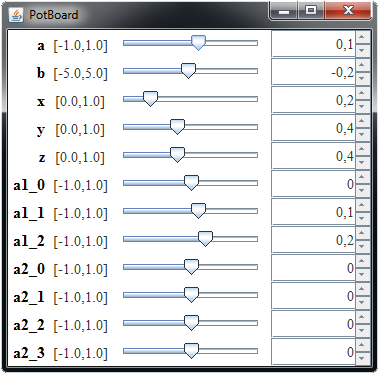
        </div>
        <div align="justify">
            Visualization and change of variables (val and var) values.
        </div>
        <a href="https://github.com/AlexCAB/MathAct/blob/master/src/main/scala/mathact/tools/pots/PotBoard.scala">Source code</a>,
        <a href="https://github.com/AlexCAB/MathAct/blob/master/src/main/scala/examples/mathact/tools/pots/PotBoardExample.scala">Example code</a>
        <h3 style="font-size:50%; font-family:verdana; color:#28AFE0">Syntax for single variables:</h3>
        <div align="left" style="font-family:Consolas;"><pre>
            [val|var] &lt;name&gt; = [init(&lt;value&gt;) | zero | in(&lt;min&gt;,&lt;max&gt;)
              | minimum(&lt;min&gt;) | maximum(&lt;max&gt;)]
            [val|var] &lt;name&gt; = [init(&lt;value&gt;) | zero] [in(&lt;min&gt;,&lt;max&gt;)
              | minimum(&lt;min&gt;) | maximum(&lt;max&gt;)
              |changed(&lt;function&gt;) | changedWithUpdate(&lt;function&gt;) ]
            [val|var] &lt;name&gt; = [init(&lt;value&gt;) | zero] minimum(&lt;min&gt;)
              maximum(&lt;max&gt;) [changed(&lt;function&gt;) | changedWithUpdate(&lt;function&gt;)]
            <p>Where:</p>
            [val|var] -- Scala keywords,
            &lt;name&gt; - Scala variable name,
            init -- operator set initial value,
            zero -- set 0 initial value,
            in -- set value diapason
            minimum -- set value diapason minimum,
            maximum -- set value diapason maximum,
            changed -- set value changed function,
            changedWithUpdate -- set value changed function with after update,
            &lt;value&gt; -- Double value of statement (default: (&lt;min&gt; + &lt;max&gt;)  / 2),
            &lt;min&gt;  -- Double, minimum variable value (default: -1),
            &lt;max&gt; -- Double, maximum variable value (default: +1),
            &lt;function&gt; -- (x)⇒{} anon function called before variable value will
              be changed, where x is new value.
        </pre></div>
        <h3 style="font-size:50%; font-family:verdana; color:#28AFE0">Syntax for array variables:</h3>
        <div align="left" style="font-family:Consolas;"><pre>
            val &lt;name&gt; = array(&lt;values&gt;)
            val &lt;name&gt; = array len(&lt;length&gt;)
            val &lt;name&gt; = array of(&lt;value &gt;) len(&lt;length&gt;)
            val &lt;name&gt; = &lt;array init&gt; [in(&lt;min&gt;,&lt;max&gt;) | minimum(&lt;min&gt;)
              | maximum(&lt;max&gt;) | changed(&lt;function&gt;) | changedWithUpdate(&lt;function&gt;)]
            val &lt;name&gt; = &lt;array init&gt; minimum(&lt;min&gt;)  maximum(&lt;max&gt;)
              [changed(&lt;function&gt;) | changedWithUpdate(&lt;function&gt;)]
            <p>Where:</p>
            array() -- set array of given values,
            array -- initial word for [of|len],
            len -- set array length,
            of -- set initial value for array elements (default: (&lt;min&gt; + &lt;max&gt;)  / 2),
            &lt;array init&gt; -- [array(&lt;values&gt;) | array len(&lt;length&gt;)
              | array of(&lt;value &gt;) len(&lt;length&gt;)]
        </pre></div>
        <h3 style="font-size:50%; font-family:verdana; color:#28AFE0">Parameters:</h3>
        <div align="left" style="font-family:Consolas;"><pre>
            name:String, screenX:Int, screenY:Int -- general parameters,
            defaultMin:Double -- default min value for all variables (default: -1),
            defaultMax:Double -- default max value for all variables (default: +1).
        </pre></div>
    <h2 style="font-size:70%; font-family:verdana; color:#28AFE0" id="ValuesBoard">ValuesBoard visualization tool</h2>
        <div align="center">
            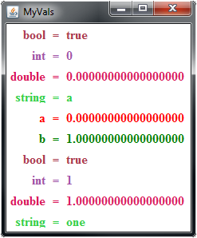
        </div>
        <div align="justify">
            Visualization of variables values.
        </div>
        <a href="https://github.com/AlexCAB/MathAct/blob/master/src/main/scala/mathact/tools/values/ValuesBoard.scala">Source code</a>,
        <a href="https://github.com/AlexCAB/MathAct/blob/master/src/main/scala/examples/mathact/tools/values/ValuesBoardExample.scala">Example code</a>
        <h3 style="font-size:50%; font-family:verdana; color:#28AFE0">Syntax:</h3>
        <div align="left" style="font-family:Consolas;"><pre>
            value(&lt;value params&gt;) of{&lt;value&gt;}
            <p>Where:</p>
            &lt;value params&gt; -- name = "..."; color = black, white, red,...
            &lt;value&gt; -- value source (variable name or statement)
        </pre></div>
        <h3 style="font-size:50%; font-family:verdana; color:#28AFE0">Parameters:</h3>
        <div align="left" style="font-family:Consolas;"><pre>
            name:String, screenX:Int, screenY:Int -- general parameters.
        </pre></div>


    <h2 style="font-size:70%; font-family:verdana; color:#28AFE0" id="SimpleStaticGraph">SimpleStaticGraph visualization tool</h2>
        <div align="center">
            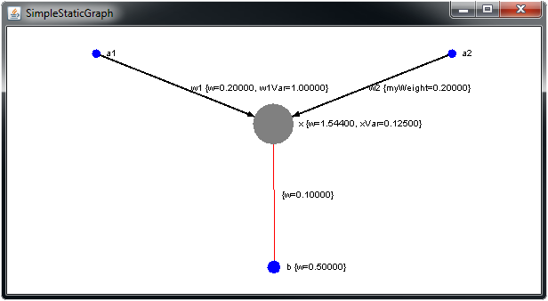
        </div>
        <div align="justify">
            Visualisation tool for small static graphs (with no adding/deleting of nodes and edges).
        </div>
        <a href="https://github.com/AlexCAB/MathAct/blob/master/src/main/scala/mathact/tools/graphs/SimpleStaticGraph.scala">Source code</a>,
        <a href="https://github.com/AlexCAB/MathAct/blob/master/src/main/scala/examples/mathact/tools/graphs/SimpleStaticGraphExample.scala">Example code</a>
        <h3 style="font-size:50%; font-family:verdana; color:#28AFE0">Syntax:</h3>
        <div align="left" style="font-family:Consolas;"><pre>
            node(&lt;node params&gt;)
            node(&lt;node params&gt;) color{&lt;color&gt;}
            node(&lt;node params&gt;) color{&lt;color&gt;} weight{&lt;weight&gt;}
            node(&lt;node params&gt;) color{&lt;color&gt;} weight{&lt;weight&gt;}
               variable(&lt;var name&gt;, {&lt;var value&gt;})
            node(&lt;node params&gt;) color{&lt;color&gt;} weight{&lt;weight&gt;}
               variable(&lt;var name&gt;, {&lt;var value&gt;}) fixOn(&lt;X&gt;,&lt;Y&gt;)
            [arc|edge](&lt;source&gt;,&lt;target&gt;,&lt;edge params&gt;)
            [arc|edge](&lt;source&gt;,&lt;target&gt;,&lt;edge params&gt;)
               color{&lt;color&gt;}
            [arc|edge](&lt;source&gt;,&lt;target&gt;,&lt;edge params&gt;)
               color{&lt;color&gt;} weight{&lt;weight&gt;}
            [arc|edge](&lt;source&gt;,&lt;target&gt;,&lt;edge params&gt;)
               color{&lt;color&gt;} weight{&lt;weight&gt;}
               variable(&lt;var name&gt;, {&lt;var value&gt;})
            <p>Where:</p>
            &lt;node params&gt; -- name = "..."; color =  black, white, red,...;
              weight = &lt;Double&gt;; fixOn = (&lt;X(Int)&gt;,&lt;Y(Int)&gt)
            &lt;edge params&gt; -- name = "..."; color =  black, white, red,...;
              weight = &lt;Double&gt;
            &lt;color&gt; -- variable or statement of Color value.
            &lt;weight&gt; -- variable or statement of Double value.
            &lt;var name&gt; -- variable or statement of String value.
            &lt;var value&gt; -- variable or statement of Double value.
        </pre></div>
        <h3 style="font-size:50%; font-family:verdana; color:#28AFE0">Parameters:</h3>
        <div align="left" style="font-family:Consolas;"><pre>
            name:String, screenX:Int, screenY:Int, screenW:Int, screenH:Int -- general
               parameters.
            resizeByWeight:Boolean -- change size of nodes and edges by
               they weight (default: false),
            showLabels:Boolean -- show or hide labels of nodes and edges(default: true)
        </pre></div>
</html>


