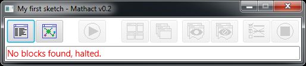
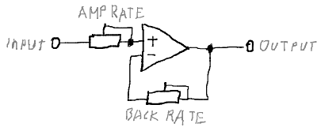
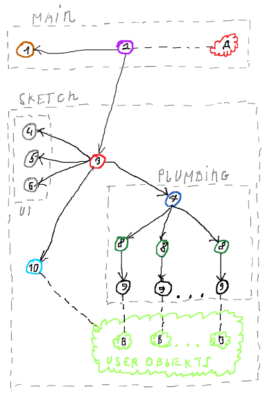

#About:

The MathAct is Scala toolset for modeling, simulating and analyzing of dynamic systems. 
It similar to [Mathlab Simulink](https://en.wikipedia.org/wiki/Simulink) 
but uses the Scala instead of Mathlab language and based on the messages propagation instead of state iteration. 
You can use it as additional toolset in your research/testing/playing projects.

Currently it is more like research project and it contain small number of tool. However, I will continue to work on 
(since it used in other projects) and encourage you to contribute in.


#Getting Started

You need to have installed [JDK 1.8+](http://www.oracle.com/technetwork/java/javase/downloads/jdk8-downloads-2133151.html) 
and [SBT 0.13+](http://www.scala-sbt.org/download.html), also some Scala IDE will be helpful.

Download or clone this repository somewhere on your local machine, for example with Git: git 
clone https://github.com/AlexCAB/MathAct.git 

Navigate to MathAct folder: cd MathAct

Now you can run examples with a command: sbt mathact_examples/run examples.Simple

In addition, you can import SBT project to your favorite IDE and run examples.Simple object from there.


#Demo

Running of couple of sketches:

<html><a href="https://youtu.be/t79zsbyRoLg"></a></html>


#Project Structure

Project comprises of next subprojects:

* Core – contains common and service definitions. 
* Tools – set of tools, which can be used to compose the sketch.
* Examples – contains a set of examples that demonstrate a using of the MathAct toolset.


#Defining of Sketch

Typical developing process of whatever complicated enough include modeling stage. I.e. when you already have an idea 
about how to solve some issue but you not sure enough in this to start of developing of concrete solution, so you 
include a modeling step for making an inexpensive evaluation of your idea. Building of mathematical model of your idea 
and then run its simulation is good option for this.  

To define and simulate an model in MathAct you can create a sketch. In fact sketch is just a Scala class that 
extends *Workbench tool class. Inside this you able to place any Scala definitions. 

Next simple example of the sketch ([MyFirstSketch.scala](https://github.com/AlexCAB/MathAct/blob/master/mathact_examples/src/main/scala/manual/sketches/MyFirstSketch.scala)):

```scala
package manual.sketches 
import mathact.tools.workbenches.SimpleWorkbench

class MyFirstSketch extends SimpleWorkbench {

//TODO Add my definitions here

}
```

Most likely, you will need more than one sketch in the project so it will useful to make a compact list of them. 
For this, you can create a list object extended from the Sketches class and register your sketches there. 
This object will have a main() method so you can start MathAct application here. After application starts, you will 
see list of all your sketches (unless you not set auto-start for some sketch).

Next example of list of sketches ([MySketches.scala](https://github.com/AlexCAB/MathAct/blob/master/mathact_examples/src/main/scala/manual/sketches/MySketches.scala)):

```scala
package manual.sketches
import mathact.tools.Sketches

object MySketches extends Sketches{
  SketchOf[MyFirstSketch](
    name = "My first sketch",
    description = "The first sketch that I define but not implemented.",
    logger = true,
    visualisation = true)
  SketchOf[MySecondSketch](
    name = "My second sketch",
    description = "The second sketch that I wrote.")
  SketchOf[MyThirdSketch](
    name = "My third sketch",
    description = "The third complex sketch.",
    logger = true)

  //TODO Add more

}
```

After launch of MySketches object you will see something like next:


Now you can hit the RUN button (green triangle) and actually launch the selected sketch. After sketch starts, you will 
see sketch control panel (read about UI below in this document):



Nothing more interesting happens, since the sketch not contain any block.


#Sketch (model) Structure

Similarly, to the Mathlab Simulink, you can compose your model from the blocks.

Unlike in the Simulink, you define a model in text format using Scala language. I am personally prefer the text format 
since I think it give more flexibility (especially when Scala used :) ), but also plan to implement graphical editor 
same like in Simulink.

Huge deferens from the Simulink is in using of [reactive streams](https://en.wikipedia.org/wiki/Reactive_Streams) 
to implement blocks interactions. I.e. the model can be represented as a graph where nodes (blocks) is the message 
processors and edges that connect the blocks, is the paths of message distribution (message streams). 

Each block have one or more connections points (inlets and outlets) that can be connected. Figuratively you can think 
about blocks like about electronic components (or [pneumatic automation](https://www.youtube.com/watch?v=IqIqpTwKMPI) 
components or hydraulic components) which could be composed to form some device and think about the messages like 
about electricity (or air or liquid) that circulate between components.


Internally the connections are implemented as messages queues, that reactive and buffering messages from other 
blocks till it will processed. During processing of income messages (received by inlet) block may send some outcome 
messages (via outlet) to other connected blocks.  

Block structure may be visualized like next:


The code of the block B from image above may look like next:

```scala
package manual.sketches
import mathact.core.bricks.plumbing.wiring.fun.FunWiring
import mathact.tools.EmptyBlock
import mathact.tools.workbenches.SimpleWorkbench

class MySecondSketch extends SimpleWorkbench {
  //Blocks
  class BlockB extends EmptyBlock with FunWiring {
    //Connection points
    val in1 = In[Double]
    val in2 = In[String]
    val out1 = Out[Double]
    val out2 = Out[String]
    //Wiring
    in1.map(_.toString) >> out2
    in1.filter(_ != 0) >> out1
    in2.map(s ⇒ "Received: " + s) >> out2
  }
  //Connecting

  //TODO

}
```

Read more about composing of blocks below in this document.

For connecting of the blocks used DSL similar to [akka-streams DSL](http://doc.akka.io/docs/akka/2.4.14/scala/stream/stream-composition.html), 
next example <ссылка на исходник> show connecting of A and B and C blocks:

```scala
package manual.sketches
import mathact.core.bricks.linking.{LinkIn, LinkOut, LinkThrough}
import mathact.core.bricks.plumbing.wiring.fun.FunWiring
import mathact.core.bricks.plumbing.wiring.obj.{ObjOnStart, ObjWiring}
import mathact.tools.EmptyBlock
import mathact.tools.workbenches.SimpleWorkbench
import scala.concurrent.Future

class MyThirdSketch extends SimpleWorkbench {
  //Blocks
  object BlockA extends EmptyBlock with ObjWiring with ObjOnStart with LinkOut[Double]{
    //Parameters
    name = "BlockA"
    //Wiring
    private val gen = new Outflow[Double] {
      def start(): Unit = Future{
        (0 to 10).foreach{ i ⇒
          pour(i)
          Thread.sleep(500)}}}
    protected def onStart(): Unit = gen.start()
    //Connection points
    val out = Outlet(gen) }
  object BlockB extends EmptyBlock with FunWiring with LinkThrough[Double, String]{
    //Parameters
    name = "BlockB"
    //Connection points
    val in = In[Double]
    val out = Out[String]
    val out2 = Out[Double]
    //Wiring
    in.map(s ⇒ "Received: " + s) >> out
    in.filter(_ % 2 == 0) >> out2 }
  object BlockC extends EmptyBlock with FunWiring with LinkIn[String]{
    //Parameters
    name = "BlockC"
    //Connection points
    val in = In[String]
    val in2 = In[Double]
    //Wiring
    in.foreach(v ⇒ logger.info("IN: " + v))
    in2.foreach(v ⇒ logger.info("IN2: " + v)) }
  object BlockD extends EmptyBlock with FunWiring with LinkIn[String]{
    //Parameters
    name = "BlockD"
    //Connection points
    val in = In[String]
    //Wiring
    in.foreach(v ⇒ logger.info("IN: " + v))}
  //Connecting
  BlockA ~> BlockB      ~> BlockC          //<-- Shortcut DSL
            BlockB.out2 ~> BlockC.in2      //<-- Standard way of connecting
            BlockB      ~> BlockD
}
```

This sketch can be represented as next graph:


Each outlet can be connected to the several inlets (for example ‘out’ block B connected to ‘in’s of block C and D), 
in this case, outlet will broadcast messages to all connected inlets. Also each inlet can be connected to the several 
outlets, in this case messages from all connected outlets will enqueued to inlet queue in the received order.

To make a connecting of blocks easier and compact, you can use shortcut-linking DSL that allow you to 
connect blocks like next:

```scala
BlockA ~> BlockB ~> BlockC
```

Instead of using standard connation DSL:  


```scala
BlockA.out ~> BlockB.in
BlockB.out ~> BlockC.in
```

In additional I encourage you to check and play with [examples](https://github.com/AlexCAB/MathAct/tree/master/mathact_examples/src/main/scala/examples).


#Simulation Approach

Same as in Simulink you can simulate discrete, continues and mixed models. However, because of parallel computing and 
message propagation nature of the reactive streams, the simulation approach is different.

Most of the modeled systems have a state, which chances during the time. Therefore, to be precise, models need to 
reflect the state too. To achieve maximum performance of parallel computing the state (i.e. data represented as 
values/objects that stored in variables) need to be distributed in some way between the computation units (i.e. blocks 
in our case) to minimize synchronization costs. Which is actually hard, especially when you using classical 
(i.e. blocking) synchronization approach, but I think using of the reactive approach make this task something simpler.

The main idea is in the taking apart of the model state and keeping of its parts inside the blocks. Moreover, in using 
of messages exchange to keep the spitted model state consist (i.e. to synchronize parts of model). You can imagine that 
as the parts of state evaluates independently from each other, and in the same time, the changes of the parts of state 
are propagated in between by messages exchange (sending of message by block with changed state and reaction 
on the changes by connected block).

Alternatively, you can design a model in the way where the divided state will stored in the messages itself and the 
blocks will just transform it (i.e. same as it happens in [Erlang language](https://en.wikipedia.org/wiki/Erlang_(programming_language)) 
for example). This will make your design work harder but give you opportunity to make simulation less buggy and more stable. 

The practice shows that it is actually hard to deal with a loops and cycles in the message exchange. They prone to the 
dead-locks and life-locks. So avoid their where you can.


###Discrete models

In this kind of models, state is discrete, i.e. contain only variables with finite amount of possible values. In case 
of using of reactive streams for implement simulation, the limited amount of possible values reduce required amount 
of the message transaction to propagate the state changes. The simple example is a binary model where variables have 
only two possible value. 

For example a simple discrete model to simulate of [D trigger](https://en.wikipedia.org/wiki/Flip-flop_(electronics)#Gated_D_latch) work:


The [sketch](https://github.com/AlexCAB/MathAct/blob/master/mathact_examples/src/main/scala/examples/common/DTriggerExample.scala) 
will look like next:

```scala
package examples.common
import mathact.tools.indicators.BoolIndicator
import mathact.tools.math.logic.bool._
import mathact.tools.pots._
import mathact.tools.workbenches.SimpleWorkbench

class DTriggerExample extends SimpleWorkbench {
  //Sketch parameters
  heading = "D-trigger example"
  //Helpers
  val dIn = new BoolSwitch{ name = "D in" }
  val eIn = new BoolStrobe{ name = "E in" }
  val indicator = new BoolIndicator{ name = "Out" }
  //Operators
  val fAnd = new And
  val iAnd = new And
  val flipFlop = new FlipFlop
  //Connecting
  dIn ~> new Not ~> fAnd ~> flipFlop.r
             eIn ~> fAnd
             eIn ~> iAnd
  dIn            ~> iAnd ~> flipFlop.s
  flipFlop.out ~> indicator.in("Q")
  flipFlop.inv ~> indicator.in("!Q")}
```

Discrete models are simple and useful to simulate of descript systems but unfortunately most of real word stuff are 
not discrete. For example to simulate flip-flop element on the couple NORs you will need to simulate the electronic 
transient processes, which have continuous nature.  


###Continuous models

Simulation of continuous models with reactive streams is a harder than discrete, because of discrete nature of 
messaging and computers in general. So, to make continuous model work on top of discrete computation system you 
need [to discretize](https://en.wikipedia.org/wiki/Discretization) the values of the model in some way.

Distribution of the state changes between the blocks can be implemented as a sending of message each time when state 
stored inside the block changes more then on some epsilon value. This will require more message transactions against 
discrete models and the actual amount of transactions will depend on selected epsilon value (then less epsilon then 
more precise model and then more transaction required).

The next one is example of simulation of [negative feedback](https://en.wikipedia.org/wiki/Negative_feedback) in amplifier: 



The [sketch](https://github.com/AlexCAB/MathAct/blob/master/mathact_examples/src/main/scala/examples/common/FeedbackExample.scala) is next:

```scala
package examples.common
import mathact.tools.indicators.ValueIndicator
import mathact.tools.math.continuous._
import mathact.tools.pots.SettingDial
import mathact.tools.workbenches.SimpleWorkbench

class FeedbackExample extends SimpleWorkbench {
  //Sketch parameters
  heading = "Continuous math example"
  //Helpers
  val input = new SettingDial{ name = "input"; min = -2; max = 2; init = 1}
  val amplifyingRate = new SettingDial{ name = "amplifying"; min = 0; max = 10; init = 2}
  val feedbackRate = new SettingDial{ name = "feedback"; min = -2; max = 2; init = 0}
  val output = new ValueIndicator{ name = "output" }
  //Operators
  val amplifier = new Multiplier
  val feedback = new Multiplier
  val adder = new Adder
  //Connecting
  amplifyingRate ~> amplifier
  feedbackRate ~> feedback
  input ~> adder ~> amplifier ~> output
  adder <~ feedback <~ amplifier}
```

###Model time

Most of real systems are temporal (i.e. depend on the time), so to simulate their correctly, the time need to be 
reflected in the model. In the case of using of reactive streams, it is more complicated because of the distributed 
state and the synchronous interaction. 

For precision simulation of time, the “virtual time” approach may be used, i.e. when model have own time that 
independent form real (computing) time. In this case, from the model viewpoint all computations will executed 
instantly and simultaneously.

For implementation of this approach, each piece of the model state, need to have a time mark, which indicate of 
time slice of the whole model state. In addiction in model should exist only one block that is a source of the time, 
i.e. provide current value of time mark for the rest of blocks.

See an example of such model in the next chapter.


#Build and Run Simple Model

Let us build and simulate a simple continuous and temporal model using the reactive streams. As example, we will use 
a model of the simple system that include a water tank with a fill and sink valves and PID regulator that control the 
fill valve to keep stable level of the water in the tank.


For the building of model, we will use regular math operators: addition, multiplication, sing inversion, integration 
and differentiation. Also, we will use the TimeLoop block that provide virtual time, the SettingDial and the 
ChartRecorder for input and output of model parameters. 

Next is a model block diagram:


Next part of the sketch (full source see [here](https://github.com/AlexCAB/MathAct/blob/master/mathact_examples/src/main/scala/examples/common/SimplePidExample.scala)):

```scala
class SimplePidExample extends SimpleWorkbench {
  //Blocks
  val timeLoop = new TimeLoop[TimedValue]{ ... }
  val chart = new ChartRecorder{ minRange = 0 }
  //Units
  val dials = new {
    val setPoint = new SettingDial{ ... }
    val drainSpeed = new SettingDial{ ... }
    val pPoint = new SettingDial{ ... }
    val iPoint = new SettingDial{ ... }
    val dPoint = new SettingDial{ ... }}
  val tank = new {
    //Blocks
    val adder = new Adder
    val integrator = new Integrator
    val multiplier = new Multiplier
    //Connecting
    multiplier ~> adder
    adder ~> integrator
    //Pins
    val effect = adder.inF
    val feedback = multiplier.inF
    val drain = multiplier.inS
    val level = integrator.out}
  val controller = new {
    //Blocks
    val signInverter = new SignInverter
    val inAdder = new Adder
    val integrator = new Integrator
    val differentiator = new Differentiator
    val pMultiplier = new Multiplier
    val iMultiplier = new Multiplier
    val dMultiplier = new Multiplier
    val outAdder = new Adder
    //Connecting
    signInverter ~> inAdder
    inAdder ~>                pMultiplier    ~> outAdder
    inAdder ~> iMultiplier ~> integrator     ~> outAdder
    inAdder ~> dMultiplier ~> differentiator ~> outAdder
    //Pins
    val r = inAdder.inS
    val y = signInverter.inF
    val u = outAdder.out
    val p = pMultiplier.inS
    val i = iMultiplier.inS
    val d = dMultiplier.inS}
  //Connecting
  dials.setPoint ~> controller.r
  dials.drainSpeed ~> tank.drain
  dials.pPoint ~> controller.p
  dials.iPoint ~> controller.i
  dials.dPoint ~> controller.d
  tank.level ~> timeLoop.in
  timeLoop.out ~> controller.y
  timeLoop.out ~> tank.feedback
  controller.u ~> tank.effect
  controller.u ~> chart.line("effect")
  tank.level ~> chart.line("level")}
```

Moreover, the short video of how it actually work:

<html><a href="https://youtu.be/aj4ekCWAzQg"></a></html>


#User Interface

The application have simple UI for a selecting of the sketch to be launch and for managing of the launched sketch.

The sketch list that display a sketches registered in the Sketches object:


1.	Name of sketch if set or class name.
2.	Description of sketch if set.
3.	State of the sketch: ready – can be launched, ended – was launched, failed – was launched and fail. 
4.	Run button to launch a sketch.

The sketch management panel, which will show after launch of sketch:


1.	Show or hide the logger UI.
2.	Show or hide visualization UI.
3.	Start the sketch, on hit the user defined start functions will executed.
4.	Fit block windows layout.
5.	Stairs block windows layout.
6.	Show all block windows.
7.	Hide all block windows.  
8.	Skip frozen tasks (see “Compose Your Own Block” chapter).
9.	Stop the sketch, on hit the user defined stop functions will executed.
10.	String that display current status of the sketch.

By hit of button "1." you will see a logger UI. This is simple UI with basic filtering and search functionality: 


By hit of button "2." you will discover simple block connection graph visualization, currently it only show connection 
structure but in future I plan to add more functionality (see “future work” chapter)


#Common Architecture

The toolset built on top of the AKKA actor’s library with using of ScalaFX for the UI. But for using of application 
you not need to have deal with actors (unless you want to) since app provide a simple OOP API for creating and 
composing of blocks.

Here is actors/objects diagram:



Whole application may be split on two parts:
* Main part – manage a sketches.
* Sketch part contain subparts:
  * UI – sketch manage, logger, visualization UI.
  * Plumping – handle messages exchange and start/stop functions. 

The app contain next actor’s:

1.	Sketch list UI actor.
2.	Main app controller, contain the logic for the start and manage of sketch.
3.	Sketch controller, contains the control and glue logic.  
4.	Sketch UI, where do start and stop buttons. 
5.	Logger UI actor.
6.	Visualization UI actor.
7.	Plumbing supervisor, manage a drives actors.
8.	Drive actors, contains the message queues and logic of them handling, logic of block UI management. 
9.	Impeller actors is a user code executer (income messages handling, start and stop function).
10.	 User object construction actor, do construction of the user defined objects (workbench and blocks).

In addition, the next objects: 

A. App singleton, where main() method locate, also used for the access of user defined objects to the actor system. 

A. User defined objects, i.e. block objects. 

This is just an approximate description, for learning more please brows the code. 


#Compose Your Own Block

Creating of your own blocks is very easy. Here is two styles to do this: OOP style and functional style. 

For creating of a block, you need to define inlets and/or outlets and to wire them in some way.

Let us define simple block that will take integer value convert it to the string and return string value.

OOP style ([full source](https://github.com/AlexCAB/MathAct/blob/master/mathact_examples/src/main/scala/manual/sketches/MyFourthSketch.scala)):

```scala
object IntObjPrinter extends EmptyBlock with ObjWiring with LinkThrough[Int, String]{
  //Wiring
  private val outflow = new Outflow[String] {
    def send(str: String): Unit = pour(str)
  }
  private val inflow = new Inflow[Int] {
      protected def drain(v: Int): Unit = {
          outflow.send("Converted" + v.toString)  
      }
  }
  //Connection points
  val in = Inlet(inflow)
  val out = Outlet(outflow) 
}
```

Functional style ([full source](https://github.com/AlexCAB/MathAct/blob/master/mathact_examples/src/main/scala/manual/sketches/MyFourthSketch.scala)):

```scala
object IntFunPrinter extends EmptyBlock with FunWiring with LinkThrough[Int, String]{
  //Connection points
  val in = In[Int]
  val out = Out[String]
  //Wiring
  in.map(v ⇒ "Converted" + v.toString) >> out
}
```

The block may be defined as an object on class inside or outside sketch class, but it is important to create block 
object during sketch object construction (in the sketch class constructor), since block can’t be built after sketch 
started.

In this example used EmptyBlock call as a super class this used for creating a simple small blocks, but there is other 
classes on which block can be based, for example Tool class.

By mixin of the ObjWiring or FunWiring you select the wiring style that you want to use in the block.

Mixin of the LinkThrough is optimal, it just provide a shortcut connection DSL to your block, so you will able to 
connect like “BlockA ~> IntPrinter  ~> BlockB” instead of “BlockA.out ~> IntPrinter.in” 
and “IntPrinter.out  ~> BlockB.in”.

Defining of connection points is different for different wiring styles. I case of using a OOP style you need use the 
Inlet() and the Outlet() functions to generate points. These functions are require a handling objects that you need 
define before. I case of functional style you can define connection points by the In[] and the Out[] function with 
providing of connection type and then to wire them by mapping of the message streams. 

The handling objects is a simple object that implement Inflow[] and/or Outflow[] traits. The first one require a 
implementing of the drain() method, which will called each time when inlet will receive new message. The second 
contain the pour() method, calling of it will send new message to other connected blocks.

In addition, to execute some code on start and/or on stop of sketch you can mixin the ObjOnStart/ FunOnStart and the 
ObjOnStop/FunOnStop traits. For OOP style they require methods implementation, which will, called during the sketch 
starting and stopping.  For functional style they provide input streams that will produce Unit value on the starting 
and stopping.

Please check examples.wiring <добавить ссылку> package for more examples. 

All external calls (staring, stopping and receiving of message) are synchronized in the block scope, so you can safely 
use Scala variables (var’s).

Inside the block you have imported ExecutionContext to use Scala Futures and method actorOf() to create your own actors 
that will child actors of the block drive actor. But in case of using of this you need take care about synchronization 
by yourself, so please make sure than you know what you do.

Also you can log some data to the sketch logged by using of logger.info(),  logger.warn() and  logger.error() methods 
inside block. However, not use it to widely sine it not designed for large amount of logging. 


#Adding Block UI

In case you want a block to have some UI, for example for output and input of data or changing of block behavior 
during sketch execution, you can mixin the BlockUI trait, which provide a bunch of helper and the integration 
to create simple UI.

Let us for example add UI to the block from previous chapter, for displaying of last received value and 
send a new value by click of button:

OOP style with direct UI definition ([full source](https://github.com/AlexCAB/MathAct/blob/master/mathact_examples/src/main/scala/manual/sketches/MyFifthSketch.scala)):

```scala
object ObjIntPrinter extends EmptyBlock with ObjWiring with BlockUI with LinkThrough[Int, String]{
  //UI definition
  class MyUI extends SfxFrame{
    //Params
    title = "MyFifthSketch - ObjWiring"
    showOnStart = true
    //Components
    val label = new Label{
      prefWidth = 200}
    val button = new Button{
      text = "Send Hi!"
      onAction = handle{ sendEvent(SentMsg("Obj Hi!")) }}
    //Scene
    scene = new Scene{
      root = new HBox {
        prefWidth = 280
        children = Seq(label, button)}}
    //Commands reactions
    def onCommand = { case UpdateVal(v) ⇒ label.text = "Last value: " + v }
  }
  //UI registration
  UI(new MyUI)
  //Wiring
  private val handler = new Inflow[Int] with Outflow[String] {
    //Binding reaction on UI event
    UI.onEvent{ case SentMsg(m) ⇒ pour(m)}
    //Income message handler method
    protected def drain(v: Int): Unit = {
      //Update UI
      UI.sendCommand(UpdateVal(v))
      //Convert and send message to next block
      pour("Converted" + v.toString)
    }
  }
  //Connection points
  val in = Inlet(handler)
  val out = Outlet(handler)
}
```

Functional style with FXML UI definition ([full source](https://github.com/AlexCAB/MathAct/blob/master/mathact_examples/src/main/scala/manual/sketches/MyFifthSketch.scala)):

```scala
object FunIntPrinter extends EmptyBlock with FunWiring with BlockUI with FunUIWiring with LinkThrough[Int, String]{
  //Connection points
  val in = In[Int]
  val out = Out[String]
  //UI definition
  UI( new FxmlFrame[MyFxmlUILike]("manual/sketches/my_fxml_ui.fxml"){
    //Params
    title = "MyFifthSketch - FunWiring"
    showOnStart = true
    //Set actions
    controller.button.onAction = handle{ sendEvent(SentMsg("Fun Hi!")) }
    //Commands reactions
    def onCommand = { case UpdateVal(v) ⇒ 
      controller.label.text = "Last value: " + v 
    }
  })
  //Wiring
  in.map(v ⇒ UpdateVal(v)) >> UI
  in.map(v ⇒ "Converted" + v.toString) >> out
  UI.map{ case SentMsg(m) ⇒ m } >> out
}
```

Using of FXML also require static controller class to be defined, for example:

```scala
trait MyFxmlUILike{ val label: Label; val button: Button}
@sfxml class MyFxmlUI(val label: Label, val button: Button) extends MyFxmlUILike
```

You can that interaction with UI also implemented as messages (commands and events) exchange, 
this solve a JavaFX EDT synchronization problem. 

In addition, please check [examples.ui](https://github.com/AlexCAB/MathAct/tree/master/mathact_examples/src/main/scala/examples/ui) package for more examples. 


#Future Work

* More tools, extension of block library.
* Dynamic recompilation of the sketches, similar to recompilation in Play framework. 
* Improving if blocks graph visualization. Adding more useful information like queues state for example. Some management of blocks, for example show/hide UI.
* Graphical sketch builder, similar to used in Simulink. 
* Dynamic adding/removing and connecting/disconnecting of blocks in the launched sketch. 
